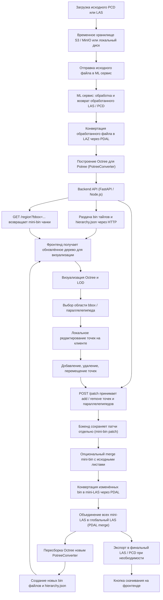

# lidar-clouds

## Схема



---

## пошаговый пайплайн

🟢 **Шаг 1. Приём и хранение исходного файла**

* **Загрузка**
  Пользователь или автоматический процесс загружает исходный файл (PCD / LAS) на сервер через веб/API.
* **Хранилище**
  Сохраняем исходник в надёжном хранилище (S3 / MinIO или локальный диск). Не отдаём гигабайтный PCD напрямую в браузер.

🟣 **Шаг 2. Отправка в ML-сервис и получение обработанного файла**

* **Отправка**
  Исходный файл по API отправляется в ML-сервис для предобработки (фильтрация, сегментация, удаление артефактов и т.п.).
* **Возврат**
  ML-сервис возвращает обработанный LAS/PCD (обозначим как «обработанный файл») — именно с ним дальше работаем.

🟡 **Шаг 3. Первичная конвертация и подготовка LOD**

* **Сжатие / переконвертация** (рекомендуется):

  ```bash
  pdal translate processed.pcd processed.laz
  ```
* **Построение Octree для Potree** (генерация тайлов/LOD):

  ```bash
  PotreeConverter processed.laz -o ./potree_data --generate-page mypointcloud --threads 6
  ```
* В результате получаем: `hierarchy.json`, набор `.bin` (leaf chunks) и возможный coarse/LOD0.

🔵 **Шаг 4. Backend API — отдача тайлов и региональная выборка**

* **Статические тайлы** (рекомендуется отдавать через Nginx): `hierarchy.json` + `.bin` файлы доступны по HTTP.
* **Endpoints**:

  * `GET /tiles/hierarchy.json` — структура дерева;
  * `GET /region?bbox=...` — возвращает mini-bin / PCD-чанк для выбранного региона;
  * `POST /patch` — принимает патчи (add/delete, bbox, список точек).

🟠 **Шаг 5. Фронтенд: визуализация и локальное редактирование**

* **Визуализация**: Potree / Open3D WebVisualizer подгружает `hierarchy.json` и по нужде `.bin` листы (LOD) — показывает общую форму и постепенно детали при приближении.
* **Выбор региона**: пользователь рисует bbox/параллелепипед или выделяет объекты.
* **Локальное редактирование**: выделение, расширение/сжатие области, удаление/добавление точек, копирование/вставка. Правки можно хранить локально (сессия) или отправлять на бек по ходу.
* **Отправка патчей**: фронт формирует JSON-патч и отправляет `POST /patch`. Пример формата:

  ```json
  {
    "region_id":"tile_42",
    "action":"delete",
    "bbox":{"min":[x1,y1,z1],"max":[x2,y2,z2]}
  }
  ```

🟤 **Шаг 6. Бэкенд: приём и сохранение патчей**

* **Сохранение слоя правок**
  Патчи сохраняются отдельно как mini-bin patch или в БД (версионирование). Исходные `.bin` остаются нетронутыми.
* **Стратегии приёма**: принимать каждое действие сразу (история на бэке) или аггрегировать (batch) — проектное решение.

🟣 **Шаг 7. Локальный merge изменённых mini-bin (опционально)**

* **Merge листа + patch**: для каждого изменённого листа объединяем исходный mini-bin и patch → получаем `tile_X_merged.bin`. Это можно сделать numpy/PDAL.
  Пример (псевдо): чтение бинаров → фильтрация → `vstack` → сохранение.
* **Если изменения небольшие** — достаточно локального merge и ручного/скриптового обновления метаданных узла.

🔵 **Шаг 8. Конвертация mini-bin → mini-LAS**

* Для подготовки к глобальному пересозданию Octree конвертируем merged bin в LAS:

  ```bash
  pdal translate tile_42_merged.bin tile_42_merged.las
  ```

🟠 **Шаг 9. Объединение mini-LAS в глобальный LAS**

* Собираем все обновлённые mini-LAS (или заменяем соответствующие области) в единый обновлённый глобальный LAS:

  ```bash
  pdal merge tile_42_merged.las tile_43_merged.las ... global_updated.las
  ```

🔴 **Шаг 10. Пересборка Octree (полная ревизия LOD)**

* Запускаем PotreeConverter на `global_updated.las` чтобы гарантированно получить корректную структуру LOD и обновлённый `hierarchy.json`:

  ```bash
  PotreeConverter global_updated.las -o ./potree_data_updated --generate-page mypointcloud --threads 6
  ```
* Результат: новые `.bin` файлы, обновлённый `hierarchy.json`, coarse/LOD0.

🟩 **Шаг 11. Обновление фронтенда и визуализация**

* Фронт подтягивает обновлённый `hierarchy.json` и новые `.bin` — отображает актуальную карту с LOD.
* Для плавности можно отдавать уведомление клиенту (webhook / websocket) о готовности новой версии.

🟨 **Шаг 12. Экспорт финального файла и скачивание**

* При необходимости экспортируем итоговый LAS/PCD:

  ```bash
  pdal translate global_updated.las final_output.pcd
  ```
* Фронтенд показывает кнопку «Скачать» — пользователь получает готовый PCD / LAS.

---

### ⛳ Резюме / практические рекомендации

* Храните исходник отдельно и **не перезаписывайте** его напрямую — используйте слои патчей.
* Для быстрой навигации отдавайте `hierarchy.json` + coarse/LOD0 и подгружайте `.bin` по требованию через HTTP (Nginx).
* Полная пересборка PotreeConverter нужна только при накоплении значительных правок или расширении облака; для мелких правок достаточно локального merge + обновления метаданных узлов.
* Логику merge / обновления JSON **автоматизируйте скриптами** (Python + PDAL), не правьте JSON руками в продакшне.

Если хочешь, могу:

* Привести пример JSON-патча и пример реализации merge-скрипта на Python.
* Включить ориентировочные временные оценки рядом с каждым шагом.
