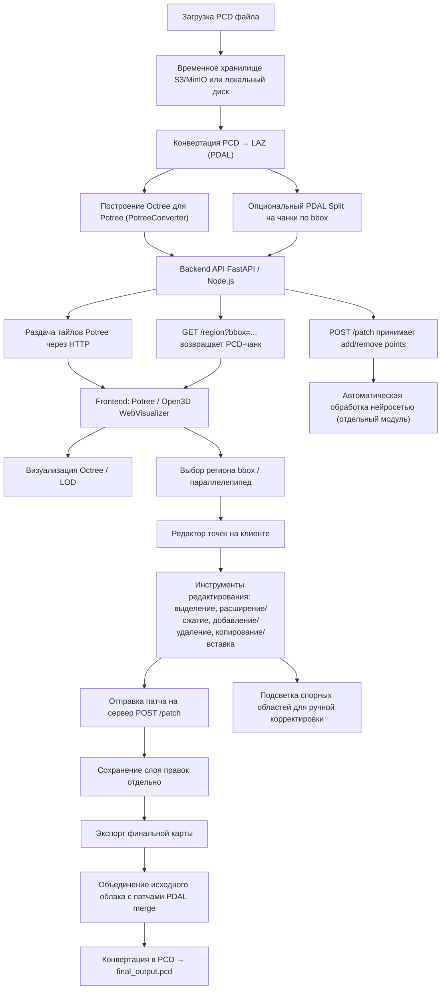

# lidar-clouds

## Схема


Ниже — подробный **пошаговый пайплайн**, который подходит для работы с гигабайтными PCD-файлами в веб-клиенте, с возможностью редактирования и сохранения результата.
Он основан на связке **PDAL → Potree (или Open3D WebVisualizer)** и поддерживает как просмотр, так и выборочные правки.

---

## 🟢 Шаг 1. Приём и хранение исходного файла

1. **Загрузка**
   Пользователь или автоматический процесс загружает большой `.pcd` файл на сервер (через API/веб).
2. **Временное хранилище**
   Сохраняем исходник в файловом хранилище (например S3/MinIO или локальный диск).
   ➜ **Важно**: не пытаться сразу отдавать PCD клиенту.

---

## 🟠 Шаг 2. Конвертация и нарезка

Цель — сделать данные пригодными для потоковой подгрузки и LOD.

1. **Конвертация PCD → LAZ** (или LAS)

   ```bash
   pdal translate input.pcd output.laz
   ```

   * LAZ сжимает точки в \~5–10 раз без потерь.
2. **Построение Octree для Potree**
   Используем `PotreeConverter`:

   ```bash
   PotreeConverter output.laz -o ./potree_data --generate-page mypointcloud
   ```

   * создаются тайлы и уровни детализации (LOD).
   * получаем структуру папок `octree.bin + hierarchy.json`.
3. **(Опция) PDAL для кастомных чанков**
   Если нужен собственный формат чанков — можно нарезать на bounding box'ы:

   ```bash
   pdal split input.laz --capacity 5e6
   ```

   Каждому чанку присваивается bbox.

---

## 🟡 Шаг 3. Backend API

Бекенд (например **FastAPI** или **Node.js**) выполняет:

* Раздачу Potree-тайлов по HTTP (для быстрой навигации).
* API `GET /region?bbox=...` → возвращает **полное облако** или PCD-чанк для редактирования.
* API `POST /patch` → принимает список изменений (добавленные/удалённые точки).

---

## 🟢 Шаг 4. Frontend (Web-клиент)

**Основная визуализация**

* Potree (или Open3D WebVisualizer) отображает octree/LOD.
* Тайлы подгружаются динамически при вращении/зумах.

**Режим редактирования**

1. Пользователь выбирает регион (bbox/параллепипед).
2. Клиент запрашивает у бекенда `GET /region` и получает **полный набор точек** только этой области (в PCD или бинарном формате).
3. На клиенте открывается редактор (Three.js/Open3D) с возможностями:

   * Выделение объектов
   * Расширение/сжатие области
   * Добавление/удаление точек
   * Копирование/вставка областей
4. После правки клиент отправляет **патч**:

   ```json
   {
     "region_id": "tile_42",
     "add_points": [...],
     "remove_points_ids": [...]
   }
   ```

---

## 🟣 Шаг 5. Обновление данных

На сервере:

1. Сохраняем «слой правок» отдельно (чтобы не перезаписывать гигабайтные данные).
2. При экспорте **финальной карты**:

   * объединяем исходное облако с патчами (через PDAL `merge`),
   * при необходимости снова переводим в `.pcd`:

     ```bash
     pdal translate merged.laz final_output.pcd
     ```

---

## ⚡ Ключевые преимущества пайплайна

| Этап              | Что даёт                                               |
| ----------------- | ------------------------------------------------------ |
| Potree Octree     | моментальная навигация даже для >100 ГБ                |
| Серверная выборка | редактирование только нужных областей                  |
| Слой правок       | быстрое сохранение изменений без перезаписи гигабайтов |
| PDAL              | гибкая конвертация PCD ⇄ LAZ, фильтрация, кропы        |

---

### 🔑 Минимальный стек

* **Backend**: Python FastAPI + PDAL + PotreeConverter.
* **Frontend**: Potree Viewer (WebGL/Three.js) + кастомные инструменты редактирования.
* **Storage**: S3/MinIO для тайлов, PostgreSQL (опция) для метаданных.

---

Этот пайплайн хорошо масштабируется:

* можно хранить десятки гигабайт данных,
* обеспечивать быструю навигацию,
* и при этом сохранять точность ручного редактирования с экспортом обратно в **PCD**.
