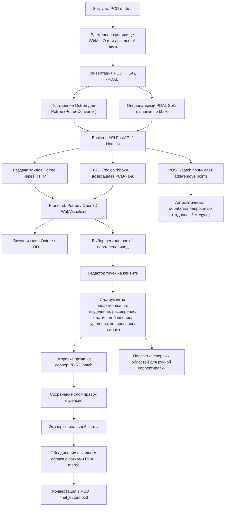

# lidar-clouds

## Схема

```mermaid
flowchart TD
    %% ==== Исходные данные ====
    A["Загрузка PCD файла"] --> B["Временное хранилище S3/MinIO или локальный диск"]
    
    %% ==== Конвертация и нарезка ====
    B --> C["Конвертация PCD → LAZ (PDAL)"]
    C --> D["Построение Octree для Potree (PotreeConverter)"]
    C --> E["Опциональный PDAL Split на чанки по bbox"]
    
    %% ==== Backend API ====
    D --> F["Backend API FastAPI / Node.js"]
    E --> F
    F --> F1["Раздача тайлов Potree через HTTP"]
    F --> F2["GET /region?bbox=... возвращает PCD-чанк"]
    F --> F3["POST /patch принимает add/remove points"]
    
    %% ==== Frontend Web-клиент ====
    F1 --> G["Frontend: Potree / Open3D WebVisualizer"]
    F2 --> G
    G --> G1["Визуализация Octree / LOD"]
    G --> G2["Выбор региона bbox / параллелепипед"]
    G2 --> G3["Редактор точек на клиенте"]
    G3 --> G4["Инструменты редактирования: выделение, расширение/сжатие, добавление/удаление, копирование/вставка"]
    G4 --> H["Отправка патча на сервер POST /patch"]
    
    %% ==== Обновление данных ====
    H --> I["Сохранение слоя правок отдельно"]
    I --> J["Экспорт финальной карты"]
    J --> J1["Объединение исходного облака с патчами PDAL merge"]
    J1 --> J2["Конвертация в PCD → final_output.pcd"]
    
    %% ==== Опции ====
    G4 --> K["Подсветка спорных областей для ручной корректировки"]
    F3 --> L["Автоматическая обработка нейросетью (отдельный модуль)"]

```